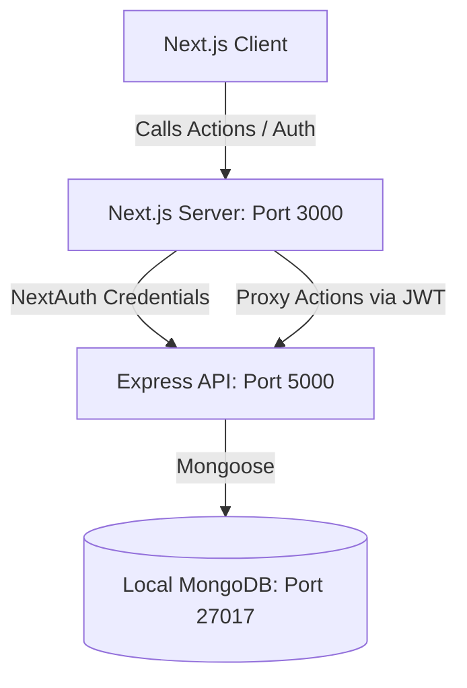

# Greenwood Gate | Apartment Visitor Log Management System

Greenwood Gate is a premium, enterprise-grade digital visitor log management system designed using **Next.js 15 (App Router)** for the frontend and a **standalone Node.js (Express) server** with **MongoDB** for the backend.

This application replaces outdated paper registers with real-time resident tap-approvals, pre-booked guest QR passes, security checkpoint terminals with photo-capture simulators, panic alarm broadcasts, and analytics audit logs.

---

## 🏗️ Architecture Design



The application is structured into two main components:
1. **Frontend (`/src`)**: Next.js App Router application. Server Actions act as secure API proxies forwarding client actions (via JWT verification) to the backend.
2. **Backend Server (`/server`)**: Standalone Express.js server running in Node.js, utilizing Mongoose to store schemas and relationships inside a local MongoDB database.

---

## 🚀 Key Features

* **Multi-Role RBAC Security**: Interfaces designed dynamically for Super Admin, Apartment Admin, Security Guard, and Resident.
* **Instant Gate Approval Desk**: Residents receive push alerts on their dashboards when visitors request entry; check-ins resolve instantly to "Inside" or "Rejected" status.
* **Pre-booked Guest QR Passes**: Residents generate VIP entry tickets containing short-lived unique shortcodes (e.g. `INV-88371`).
* **Checkpoint Scanner Terminal**: Guards scan tickets with video cameras (or input codes manually) to register auto check-ins.
* **Crisis Emergency Alarms**: Fire, medical, and security panic buttons broadcast alerts to all guard stations.
* **Reports & Analytical Charts**: Extract logs filtered by date ranges, flats, or statuses. Charts peak traffic hours and flat visitor volumes.

---

## 🛠️ Tech Stack & Setup

### Requirements
* Node.js v18+
* Local MongoDB running on `mongodb://localhost:27017`
* npm

### Quick Installation & Startup

#### 1. Setup the Database & Standalone Backend Server
Navigate into the backend directory and set up files:
```bash
# 1. Enter the server folder
cd server

# 2. Install backend dependencies
npm install

# 3. Create .env configuration (or customize the existing one)
# Ensure PORT=5000, MONGODB_URI is pointed to your local MongoDB database
```

#### 2. Seed the MongoDB Database
Populates the essential Greenwood Heights configuration, block-flat structures, and credentials required to boot the application (contains no mock data for new users):
```bash
# Run database seeder
npm run seed
```

#### 3. Run Backend Server
Start the Express server on port 5000:
```bash
npm run dev
```

#### 4. Run Frontend Server
Open a new terminal in the **root workspace directory** (`apartment-visitor-log`):
```bash
# 1. Install frontend dependencies
npm install

# 2. Start the Next.js development server
npm run dev
```
Open [http://localhost:3000](http://localhost:3000) in your browser.

---

## 🔑 Developer Quick-Login Credentials

All testing profiles use password: **`password123`**

| Role | Username / Email | Key Features |
|---|---|---|
| **Super Admin** | `superadmin@visitor.com` | Full Config settings, Guards, Residents, and Audit Log logs |
| **Apartment Admin** | `admin@visitor.com` | Broadcast announcements notices, manage guards & residents |
| **Security Guard** | `guard@visitor.com` | Manual guest entry register, camera capture, scan QR passes |
| **Resident** | `resident@visitor.com` | Pre-book invites (QR Pass), approve pending guest entries |

---

## 🎬 Core Workflows to Test

### 1. Visitor Pre-booking & Scanner Entry Check-in
1. Log in as a **Resident** (`resident@visitor.com`).
2. Go to **Pre-book Invite**. Formulate a ticket for a friend.
3. Copy the generated pass code.
4. Sign out, and log back in as a **Security Guard** (`guard@visitor.com`).
5. Go to **Scan Pass**. Paste the ticket code and click **Validate Pass**.
6. The terminal registers an automatic check-in, dispatches a success message, and notifies the host resident!

### 2. Live Guard Check-in & Resident Approval
1. Log in as a **Security Guard** (`guard@visitor.com`).
2. Go to **Register Visitor** (under manual entry).
3. Fill out details heading to flat **A-101 (Naveen Kumar)**. Take a mock registration snap. Submit check-in.
4. The system registers the visitor log as **PENDING** approval.
5. Sign out, and log back in as **Resident** (`resident@visitor.com`).
6. Notice the alert card under **Approval Desk**. Select **Approve Entry**.
7. The status updates in the system to **Inside** and registers check-in timestamps.

### 3. Crisis Panic Alarm Alerts
1. Log in as **Resident** (`resident@visitor.com`).
2. Go to **Emergency**. Press the **Medical Emergency** button and confirm.
3. Sign out, and log back in as **Security Guard** (`guard@visitor.com`).
4. Notice the high-priority alarm notification flashing on the dashboard panel. Add resolution details and resolve the incident.

### 4. Extracting PDF/CSV Analytics Reports
1. Log in as **Super Admin** (`superadmin@visitor.com`).
2. Go to **Report Center**. Select date ranges and click **Compile Report**.
3. Download the generated rows as a structured **CSV** file or click **Print PDF** to trigger printer windows.
